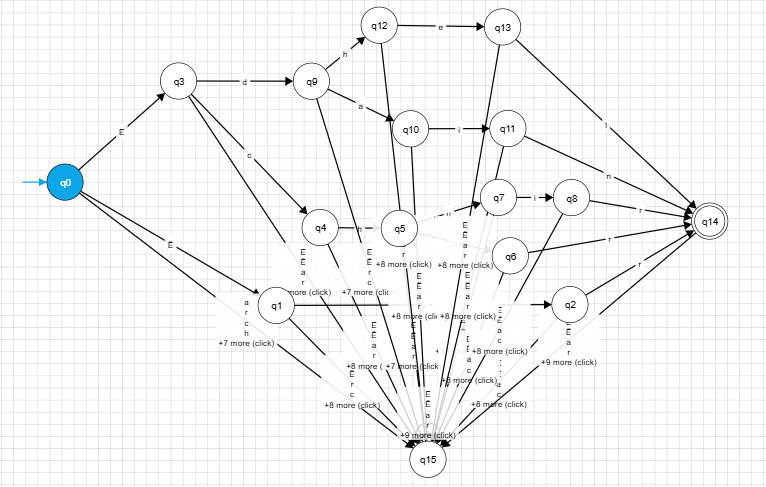

# Evidence: 1 Implementation of Lexical Analysis
Andrea Iliana Cantú Mayorga - A01753419

## Description
The language I chose is based on **"The Lord of the rings"** elvish language.
The Lord of the rings is a series of books written by **J.R.R. Tolkien**, and in this 
fantasy world called *"Middle Earth"* there are elves, dragons, kings, etc. The author,
developed a language called **Elven**, is one of the oldest languages and the parent of 
various other languages spoken by other races. For this evidence, I was given five words,
each with a different meaning: 
- **ëar**: used to describe the open sea, or the ocean. With capital letters it means the
great sea.
- **edain**: is the plural for man, but in the context it referes to mankind.
- **edhel**: it means elf, and it is used to descrribe their own people.
- **echor**: it means outer circle and it is often used to describe, natural or structural
barriers.
- **echuir**: represents the season of awakeing between winter and spring.

Analyzing this words, we can see a certain pattern, like the start with **e** or the
special character **ë**, and based on this there are certain patterns like **ch** or the 
ending with **r**. Based on the letters in the words, the automaton can only accept the 
following letters:

$\sum_{} = {ë,e,a,r,d,i,n,h,l,c,o,u}$

Meaning that the automaton is going to reject other letters that are not defined in 
the letters declared.
## Model of the solution
### Regular expresions
Regular Expresions is a notation that helps us describe all the languages that can be 
written in based of the language operators (JOIN, concatenation, Kleene concatenation, etc).
And you have to apply the symbols of a certain alphabet. Regular expresions are built in
a recursive way from the smallest regular expresions, each regular expresion denotes a 
language *L(r)*, in which it is defined in a recuursive way, from the languages denotated
from the subexpresions from *r*. This are the rules that define the expresions from a
certain alphabet $\Sigma$:
- *e* is a regular expresion, and L(e) it's {e}; the language in which the only member is an
empty string
- If *a* it's a symbol in $\Sigma$, then a it's a regular expresion, and L(*a*) = {*a*},
meaning that the language from the string, with a longevity of one, with *a* in its only
position-

Since Kleene introduced the regular expresions with basic operators for the joins,
concatenation and Kleene clousure in the decade of 1950, other expresions have been added
to the regular expresions, so that we can improve the hability to specify the patterns 
of strings, some of the symbols used in regular expressions are the following:

***Regular Expressions (Regex)***
| Character | Meaning | Example |
|:---------:|---------|---------|
| `*` | Match **zero, one or more** of the previous | `A*` matches "Ahhhhh" or "A" |
| `?` | Match **zero or one** of the previous | `Ab?` matches "A1" or "Ab" |
| `+` | Match **one or more** of the previous | `Ab+` matches "Ab" or "Abbb" but not "A" |
| `\` | Used to **escape** a special character | `Hungry\?` matches "Hungry?" |
| `.` | Wildcard character, matches **any** character | `do.+` matches "dog", "door", "dot", etc. |
| `( )` | **Group** characters | See example for `\|` |
| `[ ]` | Matches a **range** of characters | `[cbr]at` matches "car", "bar", or "far" · `[0-9]+` matches any positive integer · `[a-zA-Z]` matches ascii letters a-z (uppercase and lower case) · `[^a-z]` matches any character not 0-9 |
| `\|` | Match previous **OR** next character/group | `(Mon\|Tues)day` matches "Monday" or "Tuesday" |
| `{ }` | Matches a specified **number of occurrences** of the previous | `[0-9]{3}` matches "315" but not "31" · `[0-9]{2,4}` matches "12", "123", and "1234" · `[0-9]{2,}` matches "1234567..." |
| `^` | **Beginning** of a string. Or within a character range `[ ]` negation. | `^http` matches strings that begin with http, such as a url · `[^a-z]` matches any character not 0-9 |
| `$` | **End** of a string. | `ing$` matches "exciting" but not "ingenious" |

Having all the rules and symbols to develope a regular expresin, I was able to develope
my own Regex, following some of the patterns, found from the analysis of the strings. The
final solution was the following: <br>
`(E|Ë)(c|d|a)(h|a|r)|(o|u|i|e)|(r|n|l)`

The expresion used in the sentence above, only accepts the strings given in the
introduction area. To test my regex, you can use the following link, 
that will guide you to a Regex tester, in which you can test a lot of strings: <br>
<https://regex101.com/>


### Finite automata
As explained in **Regulare Expressions**, they are the basis to describe lexical analyzers,
and other softwares of patters processors. Finite automatas are abstract machines used to 
recognize patterns in input sequences, which is the basis for understanding regular 
languages used in computer science. Meaning that they are recognisers, they can only
answer with *'yes'* or *'no'* in relation to every probable string.
There are two types of finite automata: 
- **Non-Deterministic Finite Automata (NFA):** they have no restrictions with the labels
in their lines. A symbol can label many lines that come from the same state and euler,
even an emprty string is a possible label.
- **Deterministic Finite Automata (DFA):** They have for each state and symbol from the
input alphabet, exactly a line with the symbol from that state. <br>
Both automatas are capable of recognising the same languages, even this languages
are the same language called **regular languages**, that can help us to describe 
**regular expresions**. We represent both automatas through a transition graph, in which
the nodes are the states and the unspeakable flanks represent the transition function.
For this evidence I implemented a DFA, but it is necessary to understand
both of them so that the implementation can go a lot smoother, and easy going.

### NFA
A Non-Deterministic Finite Automaton, it can transition to multiple states. They have the 
following characteristics:
- A finite group S.
- A group of input symbols $\Sigma$, the *input alphabet*. We supose that $\mathrm{e}$ that
represents an empty string, will never be a member of $\Sigms$
- A transition function that gives for each state and for each symbol in $\Sigms$, a group
of the next states.
- A state s_0 from S, that it distinguishes itself as the intial state.
- A group of states *F*, a subgroup from S, that distinguish itself as the accepting states
or the final states.

An NFA it's really similar to a transition diagram except for:
- The same symbol can label flanks from a state to other different states.
- A flank can be labeled for $\mathrm{e}$, the empty string with the alphabet symbols.

In order to build it was necessary to build a NFA so that we can use translation rules, 
to develope our DFA. You can use Thompson's Laws to covert from an NFA to DFA, or you can
also use the technique "construction of subgroups". But, it can also be done directly from
the regular expresion to the DFA.

### DFA
DFA's are finite state machines that accept or reject strings of character by passing them
through a sequence that is uniquely determined by each string. The word "deterministic" 
means that each state sequence is unique. In a DFA a string of symbols is passed through
a DFA to see if it is accepted or not, Every input symbol moves to the next state 
that can be determined on the automaton. These machines or automatons are also called 
finite, because there is a limit to the number of states that it can reached.

A DFA it's a simple and concrete algorithm, used to recognise the strings of a language,
but it has some differences from the NFA like:
- There are no movementes in the input $\mathrm{e}$
- For each state *s* and each input symbol a, there is exactly on line that appears.

For this evidene I converted my regular expresion to a DFA directly, following this rules:
- Build a syntax tree *T* in basis of the regular expresion.
- Calculate anulable, firstpos, ultimapos, nextpos for *T* using direct recursiveness on
the height of the tree.
- Build *Destados*, from the group of states in the AFD and the states *Dtran* table. The 
*D* states are positions in *T*. At the beginning, each state is "without label", and the
state is labeled just before we consder the output transactions. The acceptance state are
the ones that contain the position for the symbol in the final marker #.

Given this information I implemented, a DFA because there **is a limited** number of states
that can be determined, and we have a series of letters that it can only accept the 
automaton and we also have some patterns within this words that it can be modeled in this
DFA. The first DFA that I designed, was not implemented in a very efficient way as there
are multiple states in which the string is rejected and there are multiple states that
accepts this strings. One for each string:


*Frst DFA iteration*

In this picture you can see the basis of the automaton, in which the other automaton
is based on: 

*Basis DFA*

Because the first DFA is really big and there are a lot of Accepting and Rejecting states,
it makes harder the coding process and innecessary states are made. 
I simplified this expresion, by having a similar structure, but simplifying acepting
and rejecting states:

*Simplified DFA*

For the display of the automaton, I used the page called Automataverse,
<https://www.automataverse.com/simulator>. I also downloaded the .JSON found in the 
following file `automata_DFA (1).json`.

Having my DFA, I developed a Dtran table or as I like to call it states tables. In which
it was used to guide the coding:
**Transition table (Dtran)**
| Origin-action | Destination |
| q0 E | q3 |
| q0 Ë | q1 |
| q1 a | q2 |
| q2 r | q14 |
| q3 d | q9 |
| q3 c | q4 |
| q4 h | q5 |
| q5 o | q6 |
| q5 u | q7 |
| q6 r | q14 |
| q7 i | q8 |
| q8 r | q14 |
| q9 a | q10 |
| q9 h | q12 |
| q10 i | q11 |
| q11 n | q14 |
| q12 e | q13 |
| q13 l | q14 |

## Implementation
Having all the necessary tools, I started to develope the code in Prologue. It is necessary
to remark that instead of the special letter "Ë", I used the number 3. As prologue does 
not recognise that letter like a string. In the beginning of the code I translated my Dtran
table into facts called "move" `move(current_state, next_state, transition letter).`. 
This was done for each state from q0 to q14, in the code is seen like this:

```prolog
move(q0,q1,3). 
move(q0,q3,e).
move(q1,q2,a).
move(q2,q14,r). %Final state
move(q3,q4,c).
move(q3,q9,d).
move(q4,q5,h).
move(q5,q6,o).
move(q5,q7,u).
move(q6,q14,r). %Final state
move(q7,q8,i).
move(q8,q14,r). %Final state
move(q9,q10,a).
move(q9,q12,h).
move(q10,q11,i).
move(q11,q14,n). %Final state
move(q12,q13,e). 
move(q13,q14,l). %Final state
```

## Tests

## Analysis

## Reference
