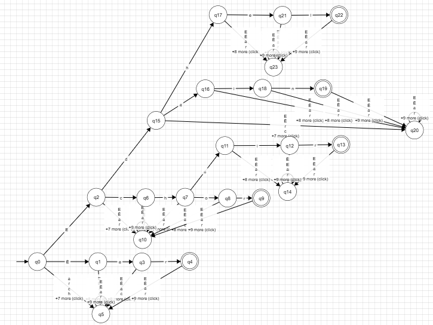
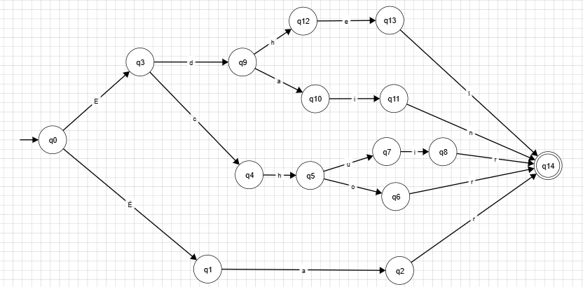

# Evidence: 1 Implementation of Lexical Analysis
Andrea Iliana Cantú Mayorga - A01753419

## Description
The language I chose is based on **"The Lord of the rings"** elvish language.
The Lord of the rings is a series of books written by **J.R.R. Tolkien**, and in this 
fantasy world called *"Middle Earth"* there are elves, dragons, kings, etc. The author,
developed a language called **Elven**, is one of the oldest languages and the parent of 
various other languages spoken by other races. For this evidence, I was given five words,
each with a different meaning: 
- **ëar**: used to describe the open sea, or the ocean. With capital letters it means the
great sea.
- **edain**: is the plural for man, but in the context it referes to mankind.
- **edhel**: it means elf, and it is used to descrribe their own people.
- **echor**: it means outer circle and it is often used to describe, natural or structural
barriers.
- **echuir**: represents the season of awakeing between winter and spring.

Analyzing this words, we can see a certain pattern, like the start with **e** or the
special character **ë**, and based on this there are certain patterns like **ch** or the 
ending with **r**. Based on the letters in the words, the automaton can only accept the 
following letters:

$\sum_{} = {ë,e,a,r,d,i,n,h,l,c,o,u}$

Meaning that the automaton is going to reject other letters that are not defined in 
the letters declared.
## Model of the solution
### Regular expresions
Regular Expresions is a notation that helps us describe all the languages that can be 
written in based of the language operators (JOIN, concatenation, Kleene concatenation, etc).
And you have to apply the symbols of a certain alphabet. Regular expresions are built in
a recursive way from the smallest regular expresions, each regular expresion denotes a 
language *L(r)*, in which it is defined in a recuursive way, from the languages denotated
from the subexpresions from *r*. This are the rules that define the expresions from a
certain alphabet $\Sigma$:
- *e* is a regular expresion, and L(e) it's {e}; the language in which the only member is an
empty string
- If *a* it's a symbol in $\Sigma$, then a it's a regular expresion, and L(*a*) = {*a*},
meaning that the language from the string, with a longevity of one, with *a* in its only
position-

Since Kleene introduced the regular expresions with basic operators for the joins,
concatenation and Kleene clousure in the decade of 1950, other expresions have been added
to the regular expresions, so that we can improve the hability to specify the patterns 
of strings, some of the symbols used in regular expressions are the following:

| Character | Meaning | Example |
|:---------:|---------|---------|
| `*` | Match **zero, one or more** of the previous | `A*` matches "Ahhhhh" or "A" |
| `?` | Match **zero or one** of the previous | `Ab?` matches "A1" or "Ab" |
| `+` | Match **one or more** of the previous | `Ab+` matches "Ab" or "Abbb" but not "A" |
| `\` | Used to **escape** a special character | `Hungry\?` matches "Hungry?" |
| `.` | Wildcard character, matches **any** character | `do.+` matches "dog", "door", "dot", etc. |
| `( )` | **Group** characters | See example for `\|` |
| `[ ]` | Matches a **range** of characters | `[cbr]at` matches "car", "bar", or "far" · `[0-9]+` matches any positive integer · `[a-zA-Z]` matches ascii letters a-z (uppercase and lower case) · `[^a-z]` matches any character not 0-9 |
| `\|` | Match previous **OR** next character/group | `(Mon\|Tues)day` matches "Monday" or "Tuesday" |
| `{ }` | Matches a specified **number of occurrences** of the previous | `[0-9]{3}` matches "315" but not "31" · `[0-9]{2,4}` matches "12", "123", and "1234" · `[0-9]{2,}` matches "1234567..." |
| `^` | **Beginning** of a string. Or within a character range `[ ]` negation. | `^http` matches strings that begin with http, such as a url · `[^a-z]` matches any character not 0-9 |
| `$` | **End** of a string. | `ing$` matches "exciting" but not "ingenious" |
<caption>Regular Expressions (Regex) Cheat Sheet</caption>

Having all the rules and symbols to develope a regular expresin, I was able to develope
my own Regex, following some of the patterns, found from the analysis of the strings. The
final solution was the following:  
`(E|Ë)(c|d|a)(h|a|r)|(o|u|i|e)|(r|n|l)`

The expresion used in the sentence above, only accepts the strings given in the
introduction area. To test my regex, you can use the following link, 
that will guide you to a Regex tester, in which you can test a lot of strings:  
<https://regex101.com/>

### Finite automata
Finite automata are abstract machines used to recognize patterns in input sequences, which
is the basis for understanding regular languages used in computer science. There are two
types of finite automata: Non-Deterministic Finite Automata (NFA) and Deterministic Finite 
Automata (DFA). For this evidence I implemented a DFA, but it is necessary to understand
both of them so that the implementation can go a lot smoother, and easy going.

### DFA
DFA's are finite state machines that accept or reject strings of character by passing them
through a sequence that is uniquely determined by each string. The word "deterministic" 
means that each state sequence is unique. In a DFA a string of symbols is passed through
a DFA to see if it is accepted or not, Every input symbol moves to the next state 
that can be determined on the automaton. These machines or automatons are also called 
finite, because there is a limit to the number of states that it can reached.

For this evidence I implemented a DFA because there **is a limited** number of states that
it can be determined, and we have a series of letters that it can only accept the 
automaton and we also have some patterns within this words that it can be modeled in this
DFA. The first DFA that I designed, was not implemented in a very efficient ways as there
are multiple states in which the string is rejected and there are multiple states that
accepts this strings. One for each string:

Because this DFA is really big and there are a lot of Accepting and Rejecting states,
it is much easier to code and simplify this DFA. I simplified this expesion, by having 
the same 

### NFA
A Non-Deterministic Finite Automaton, it can transition to multiple state 

## Implementation

## Tests

## Analysis

## Reference
